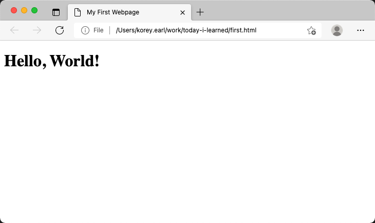
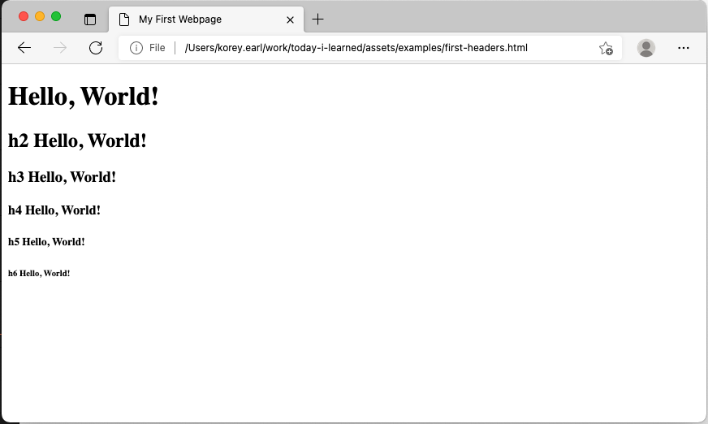

# How to create a web page

2021-07-09 - Korey Earl

Today, you are going to learn how to create your very own web page.  It's not going to be the fanciest web page ever, but hey, everybody's gotta start somewhere so let's get going.

This topic also assumes you know how to create a raw text file. <a href="https://www.computerhope.com/issues/ch001359.htm" target="_blank">Find Out How</a>

## Step 1
Copy the following code, and paste it into your text editor.
```html
<!DOCTYPE html>
<html>
  <head>
    <title>My First Webpage</title>
  </head>
  <body>
    <h1>Hello, World!</h1>
  </body>
</html>
```

## Step 2
Save your text file as `first.html`

## Step 3
Open your text file using your web browser. [Find Out How](https://www.w3schools.com/html/html_editors.asp)

You should get a page that looks something like this:



# How does it work?

## Hyper Text Markup Language (HTML)
When you open a text file with an extension of .html or .htm in your browser, the file is interpreted by your browser and converted into what you see. There are many different web browsers available and each one converts an html file differently. Let's look line by line to learn how most browsers interpret your file.

```html
<!DOCTYPE html>
```
This line tells the browser exactly which standard to use to interpret your text file. In this case it's [__HTML version 5__](https://www.w3.org/TR/html52/).

```html
<html>
```
This line is the root tag of an html document.  Every other tag is placed within the opening and closing __html__ tags.

```html
<head>
```
Is an opening tag that lets the browser know that this is the beginning of the __head(er)__ section of our html document.  A __tag__ is a block of text starting with a "__&lt;__" and ending with a "__&gt;__" symbol.  The browser knows to interpret the next lines as part of the __head__ of your document which is interpreted differently than the __body__ of your document.

```html
    <title>My First Webpage</title>
```
The opening title tag, __&lt;title&gt;__, tells the browser what to name the tab that your web page is shown in.  The other tag, __&lt;/title&gt;__, is called a closing tag. 

Take note of the "__/__" character before the word __title__ in the closing tag. Every letter, number or symbol in an html document is interpretted by the browser and a single character can make a big difference. 

The words between the opening and closing tags are known as text and can be whatever you want as long as it doesn't contain any "__&lt;__" or "__&gt;__" characters. 

Most browsers will limit the amount of text in a tab title so a short descriptive title is important.

```html
</head>
```
A closing head tag that tells the browser we are are finished with the head section.

```html
<body>
```
The opening body tag that begins the __body__ or our web page.  Essentially everything that we want to user to see in the largest section of our web browser.

```html
    <h1>Hello, World!</h1>
```

The __h1__ tag tells the browser to display everything between the tags in a large bold font or __Heading__.  There are six levels of headers, __h1__ being the largest, __h6__ the smallest.  

```html
  </body>
</html>
```
The rest of the lines are closing tags to complement the opening body tag and opening html tags.

One thing to remember with tags is that each one has an opening and closing tag.  An opening tag that appears after another opening tag, must have a closing tag that appears before the first tags closing tag.  For example:

```html
    <body>
        <h1>
    </body>
        </h1>
```
is invalid.

## Challenge
Try to edit first.html using the __h1__ through __h6__ tags so that it looks like this.



## Conclusion
We just learned the basics of creating a web page.  We walked through the structure of an HTML Document.  At the heart of every web page on the internet, is the same basic HTML structure.  Next, we'll explore some more of the basics of a web page when we look into Cascading Style Sheets and JavaScript.