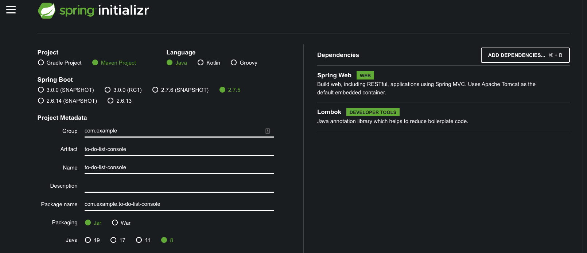
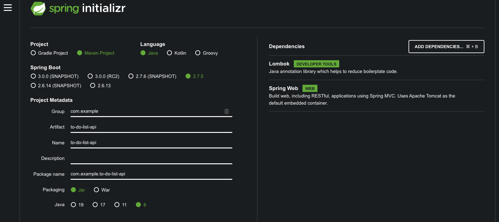

# Pact Testing

Tags: [ _Advanced_, _Java_, _SpringBoot_, _Maven_ ]

## Summary

In a microservices environment, it is important to ensure that before a new version of a __provider__ service is deployed, it will continue to adhere to the existing contract with its __consumers__.  Breaking this contract, even slightly, may result in momentus consequences.  As the number of microservices increases, running integration tests between all the other microservices becomes exponentially more expensive (an O<sup>n</sup> problem).  

One way to get around this problem without sacrificing deployment confidence is to define a formal contract between the __provider__ and __consumer__ and test each independently against the contract.  As long as the consumer adheres to the agreed upon contract and the provider also adheres to the agreed upon contract, a new version of either can be deployed without fear that something disasterous will occur.

The [PACT Specification](https://docs.pact.io/implementation_guides/pact_specification) is a popular, language agnostic, format for defining the formal contract between consumers and providers.  PACT files are just JSON files and can be authored by hand, but are often generated by a consumer through a set of unit tests.

## PACT JVM

[PACT JVM](https://docs.pact.io/implementation_guides/jvm) is a suite of java libraries that allow you to integrate pact testing into your JVM based project.  This article will focus on [pact-jvm-consumer-junit5](https://docs.pact.io/implementation_guides/jvm/consumer/junit5) which is focused on allowing you to write JUnit style tests as part of a consumer codebase against a PACT contract.  Additionally, the library contains a number of Domain Specific Language fluent APIs to build out a PACT contract programatically.

## Getting Started

### STEP 1: Create a simple ToDo ReST Client

Our ToDo application will allow the user to
- Create ToDo Items
- Retrieve the list of ToDo Items
- Delte a ToDo Item

Each ToDo Item will have an ID and a Description

_Note: The remainder of this step will reference a project created with [Spring Initializr](https://start.spring.io/).  The complete code for this example can be found in github._

We'll start with a project with these options:


1. Download and open the project in your favorite IDE.

1. Add the following Spring Configuration property to your `application.properties` file which tells Spring that it should not listen for incoming TCP connections and specifies the url for our ToDo List service.

    ```ini
    spring.main.web-application-type=NONE
    todo-service.url=http://localhost:8080/
    ```

1. Create a ToDoItem class to represent a single To Do List Item 

    ```java
    @Jacksonized
    @Builder
    @Value
    public class ToDoItem {
        int ID;
        String description;
    }
    ```

1. Create a ToDoListService class to handle the http calls to our ToDo List service.

    ```java
    @Component
    public class ToDoListService {
    
        private final RestTemplate restTemplate;
    
        @Autowired
        public ToDoListService(RestTemplate restTemplate) {
            this.restTemplate = restTemplate;
        }
        
        public List<ToDoItem> getItems() {
            ToDoItem[] items = restTemplate.getForObject("/items", ToDoItem[].class);
    
            return items == null ? new ArrayList<>() : Arrays.asList(items);
        }
    }
    ```

1. Update `ToDoListConsoleApplication.java` to add a basic rest call to the ToDo List service

    ```java
    @SpringBootApplication
    public class ToDoListConsoleApplication implements CommandLineRunner {
    
        private ApplicationContext context;
    
        public static void main(String[] args) {
            SpringApplication.run(ToDoListConsoleApplication.class, args);
        }
    
        @Override
        public void run(String... args) {
            System.out.println(context.getBean(ToDoListService.class).getItems());
        }
    
        @Bean
        RestTemplate restTemplate(@Value("${todo-service.url}") String url) {
            return new RestTemplateBuilder().rootUri(url).build();
        }
    
        @Autowired
        public void context(ApplicationContext context) {
            this.context = context;
        }
    }
    ```

1. If you run the project now (`./mvnw spring-boot:run`), you will get an error because you don't yet have an actual To Do List Service.  Don't worry, we'll implement the service later.

### Step 2: Create a Pact Test

We can now add a unit test that allows us to establish a contract between our console application and our To Do List service. 

1. Add the following dependency to your `pom.xml` file

    ```xml
    <dependency>
		<groupId>au.com.dius.pact.consumer</groupId>
		<artifactId>junit5</artifactId>
		<version>4.3.16</version>
		<scope>test</scope>
	</dependency>
    ```

1. Create a new unit test class and add the PACT annotations

    ```java
    @ExtendWith(PactConsumerTestExt.class)
    @PactTestFor(providerName = "ToDoListService")
    public class ToDoListServicePactTests {
    }
    ```

1. Add a `getItemsPact` method to the ToDoListServicePactTest class

    ```java
    @Pact(consumer = "ToDoListConsoleApp", provider = "ToDoListService")
    RequestResponsePact getItems(PactDslWithProvider builder) {
        return builder.given("items exist")
            .uponReceiving("get items")
            .method("GET")
            .path("/items")
            .willRespondWith()
            .status(200)
            .body(
                newJsonArrayMinLike(2, array ->
                    array.object(object -> {
                        object.numberType("id", 1);
                        object.stringType("description", "clean house");
                    })
                ).build())
            .toPact();
    }
    ```

1. Next, add a unit test to the ToDoListServicePactTest class

    ```java
    @Test
    @PactTestFor(pactMethod = "getItemsPact", pactVersion = PactSpecVersion.V3)
    void getAllItems_whenItemsExist(MockServer server) {
        ToDoItem item = new ToDoItem(1, "clean house");
        List<ToDoItem> expected = Arrays.asList(item, item);

        RestTemplate restTemplate = new RestTemplateBuilder().rootUri(server.getUrl()).build();
        List<ToDoItem> actual = new ToDoListService(restTemplate).getItems();

        assertEquals(expected, actual);
    }
    ```

1. Running `./mvnw test` will now generate a pact file in the `target/pacts` directory.  By opening up `ToDoListConsoleApp-ToDoListService.json` you can view the PACT file in it's raw JSON format.

### STEP 3: Create a simple ToDo ReST API

_Note: The remainder of this step will reference a project created with [Spring Initializr](https://start.spring.io/).  The complete code for this example can be found in github._

We'll start with a project with these options:


1. Create a ToDoItem class to represent a single To Do List Item 

    ```java
    @Jacksonized
    @Builder
    @Value
    public class ToDoItem {
        int ID;
        String description;
    }
    ```

1. Copy the `ToDoListConsoleApp-ToDoListService.json` generated by the console application in the previous section to the `src/test/resources/pacts` directory in the API project

1. Add the following dependency to the `pom.xml` file

    ```xml
    <dependency>
		<groupId>au.com.dius.pact.consumer</groupId>
		<artifactId>junit5</artifactId>
		<version>4.3.16</version>
		<scope>test</scope>
	</dependency>
    ```

1. Create a test class `ToDoListServicePactTests` with the following content
    ```java
    @Provider("ToDoListService")
    @PactFolder("pacts")
    @ExtendWith(SpringExtension.class)
    @SpringBootTest(webEnvironment = SpringBootTest.WebEnvironment.RANDOM_PORT)
    public class ToDoListControllerPactTests {
    
        @LocalServerPort
        int port;
    
        @BeforeEach
        void setUp(PactVerificationContext context) {
            context.setTarget(new HttpTestTarget("localhost", port));
        }
    
        @TestTemplate
        @ExtendWith(PactVerificationInvocationContextProvider.class)
        void verifyPact(PactVerificationContext context) {
            context.verifyInteraction();
        }
    
        @State("items exist")
        void toItemsExist() {}
    }
    ```

1. Running `./mvnw test` at this point will generate a Pact error because we haven't built our controller yet.

1. Let's fix the errors by adding a `ToDoListController` class
    ```java
    @RestController
    public class ToDoListController {
    
        @GetMapping("items")
        public List<ToDoItem> getAllItems() {
            return Arrays.asList(
                    new ToDoItem(1, "clean house"),
                    new ToDoItem(2, "wash car"));
        }
    }
    ```

1. Running `./mvnw test` will pass all tests. We now have a very basic Pact Consumer and Provider.  In the next article, we will setup a Pact broker and update the code so that the Pact file does not need to be copied between the consumer project and the provider project.

